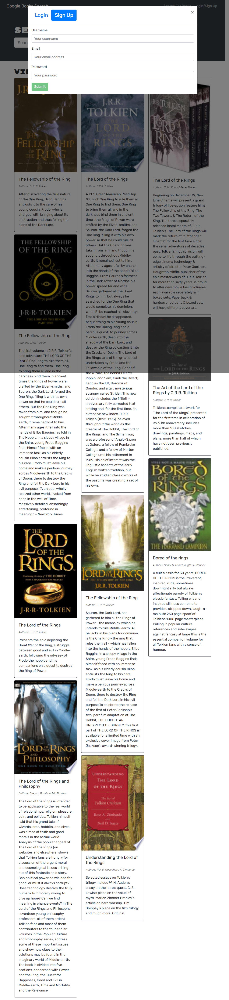

# book-search-engine


## Table of Contents

- [book-search-engine](#book-search-engine)
  - [Table of Contents](#table-of-contents)
  - [deployed url](#deployed-url)
  - [Description](#description)
  - [Installation](#installation)
  - [Usage](#usage)
  - [License](#license)
  - [Contributing](#contributing)
  - [Tests](#tests)
  - [screenshots](#screenshots)

## deployed url

https://dry-woodland-01292.herokuapp.com/

## Description

I've been tasked with making a book searching app.
Using MERN stack and GraphQL with Apollo server.

## Installation

```
git clone git@github.com:Cratesy/book-search-engine.git
cd book-search-engine
npm install
```

## Usage

```
As a user you can search for books.
as a user you can sign-up.
as a user you can log-in, once logged in you can save books to a books list.
as a logged in user you can click on see your books to see your books list. you can also remove any books from this list you want by clicking delete this book.
as a logged in user you can logout.
```

## License

[MIT License](https://opensource.org/licenses/MIT)

## Contributing

[Mike](https://github.com/Cratesy)

## Tests

None were need

## screenshots





